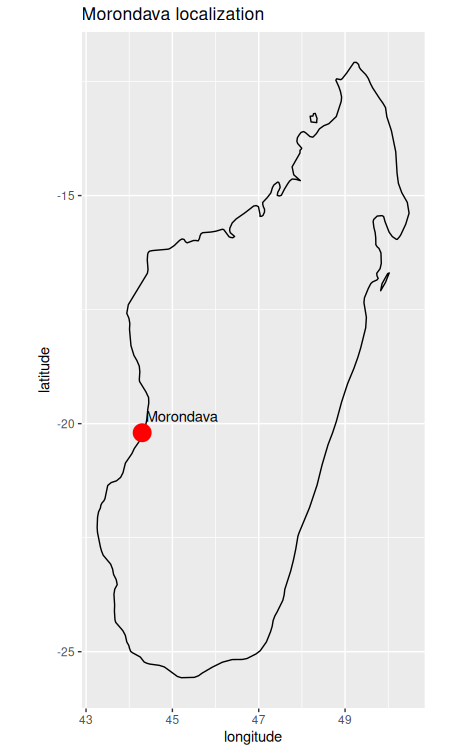
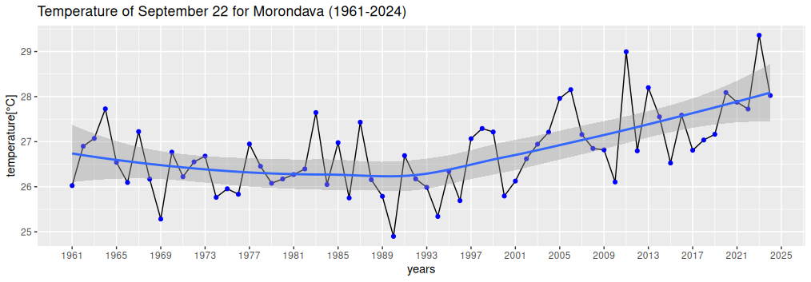

<h1>Morondava's temperature analysis for September 22nd, from 1961 to 2024</h1>

This repository was made as a microsproject, because we were heading for a study trip at Morondava on September 22nd, 2025, and also a microproject just for fun. The data was downloaded from Copernicus Climate Date Store, especially the ERA5 reanalysis dataset. The periode was between 1961 and 2024, especially September 22nd at 10 AM.

<h2>Localization of Morondava</h2>

Morondava is a place located at the region of Menabe, at -20.2°latitude and 44.3° longitude. It's famous by its touristic sites such as the Belo sur mer, the Kirindy forest,
the Zazamala national park, the beach, etc...The climate of this area is tropical, with a rainy period from December to March and a really hot climate, as www.climatetotravel.com says.

<h2>Plot overview</h2>

<ul><li>Mean temperature : 26.77°C</li>
  <li>Standart deviation of temperature : 0.87°C</li>
  <li>Min value of  temperature observed : 24.9°C observed in 1990</li>
  <li>Max value of temperature observed : 29.36°C observed in 2013</li>
  <li>Interval estimation of the mean temperature (at signification level 0.01) : [26.766°C,26.768°C]</li>
  <li>Mean temperature from 1961 to 1993 : 26.4°C with a decreasing trend</li>
  <li>Mean temperature from 1993 to 2024 : 27.1°C with an uprising trend</li>
  <li>Value of the statistical test at a signification level 0.01 while comparing the period before 1993 and after 1993 : 3.5645,
  which is higher than 2.33, the value corresponding to 0.01, so we can estimate the period before 1993 colder than after this year.</li>
<ul/>
<h2>Tools and method</h2>
<ul><li>R 4.3.3</li>
  <li>Rstudio 2025.05.0</li></ul>
